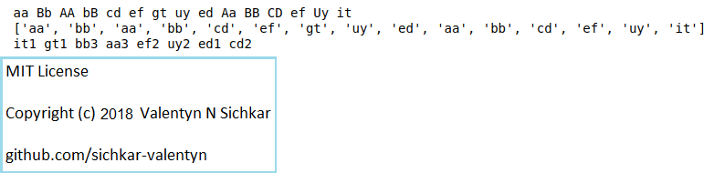

# Compressing the string using Sets in Python
Using Set we are going to calculate how many times each element was met in the String

### Courses:
* Explore the course **"Convolutional Neural Networks for Image Classification"** here: https://stepik.org/course/53801/promo

### Reference to:
[1] Valentyn N Sichkar. Compressing the string using Sets in Python // GitHub platform [Electronic resource]. URL: https://github.com/sichkar-valentyn/Compressing_the_string_using_Sets_in_Python (date of access: XX.XX.XXXX)

## Description
The goal is to compress the input string with elements divided by gaps with the element itself and number it was met in the initial string.

## GUI in Python

## MIT License
## Copyright (c) 2018 Valentyn N Sichkar
## github.com/sichkar-valentyn
### Reference to:
[1] Valentyn N Sichkar. Compressing the string using Sets in Python // GitHub platform [Electronic resource]. URL: https://github.com/sichkar-valentyn/Compressing_the_string_using_Sets_in_Python (date of access: XX.XX.XXXX)
